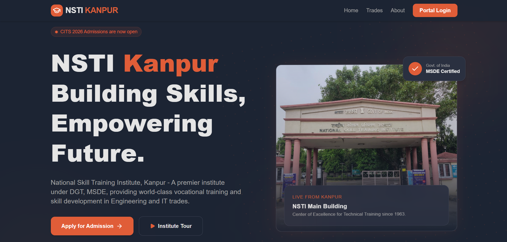
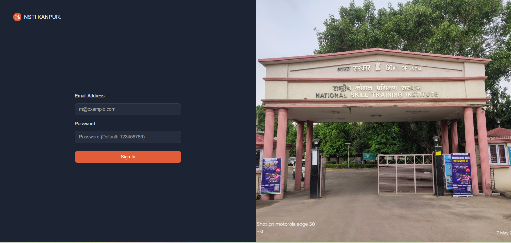
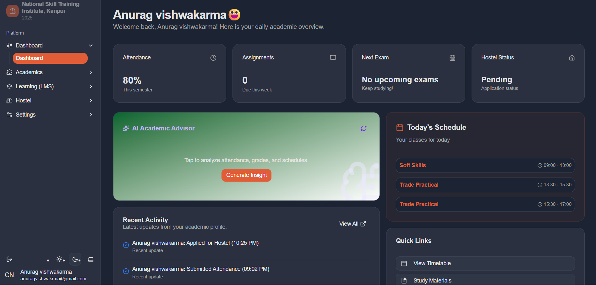
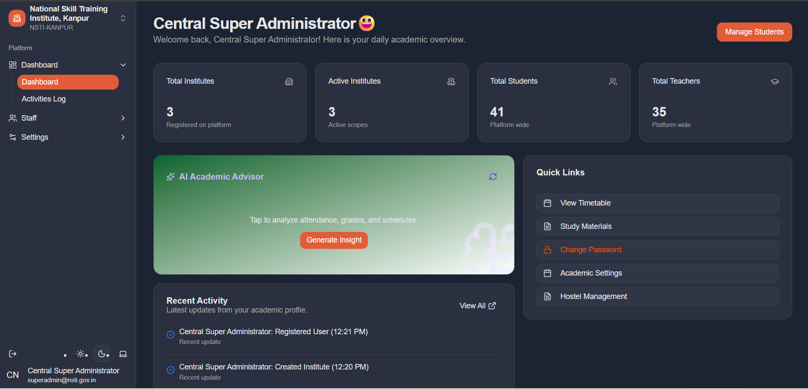

# 🎓 NSTI Kanpur Portal 

A comprehensive, state-of-the-art Learning Management and Institute Portal for **NSTI Kanpur** (National Skill Training Institute). Built with the MERN stack and styled with a premium **Supabase-inspired dark theme**.

---

## 🚀 Overview

NSTI Kanpur Portal is designed to modernize technical education management. From automated hostel allotments to AI-powered academic scheduling, this portal serves as a unified digital hub for students, teachers, and administrators of NSTI Kanpur (under DGT, MSDE).

---

## 🛠️ Tech Stack

- **Frontend:** React.js, Tailwind CSS, Lucide Icons.
- **Backend:** Node.js, Express.js.
- **Database:** MongoDB (Mongoose).
- **Automation & AI:** Inngest (Background Tasks), Google Gemini AI.
- **Communications:** Nodemailer (SMTP/Gmail).
- **Geocoding:** PositionStack API (for distance calculations).

---

## 🔐 Demo Login Credentials

The backend automatically creates these demo accounts during database initialization if they do not already exist:

| Role | Email | Password |
|---|---|---|
| Student | `demo.student@nsti.gov.in` | `Demo@123456` |
| Admin | `demo.admin@nsti.gov.in` | `Demo@123456` |
| Super Admin | `superadmin@nsti.gov.in` | `superadmin123` |

> **Note:** Demo accounts are intended only for portfolio/testing purposes. Change or remove them before using this project with real institute data.

---

## 🚩 Problem Statement

Managing a National Skill Training Institute (NSTI) involves complex administrative tasks such as tracking student/teacher data across various technical trades, managing high-volume attendance, and allocating hostel rooms fairly for outstation students.

---

## ✨ Core Features

### 1. 🔐 Role-Based Access Control (RBAC)
- **Admin:** Manage users, configure academic years, oversee hostel operations, and track system-wide activity.
- **Teacher:** Mark attendance, manage subjects, and utilize AI for timetable and exam generation.
- **Student:** Track attendance, apply for hostel, submit maintenance requests, and view profiles.

### 2. 🏨 Hostel Management System
- Smart distance-based prioritization using PositionStack.
- Automated room allotment and maintenance workflow.
- Email notifications for approvals and status changes.

### 3. 📚 Academic & Attendance
- Attendance tracking with role-based dashboards.
- AI-powered timetable and exam generation.
- Low-attendance email alerts.

### 4. 📧 Automated Email System
- Welcome emails for registered users.
- Hostel and maintenance notifications.

---

## ⚙️ Setup & Installation

### Prerequisites
- Node.js & npm installed.
- MongoDB Atlas account.
- Gmail App Password for SMTP.
- PositionStack API Key.

### Steps
1. **Clone the Repo**
2. Go to `backend/` and run `npm install`.
3. Create the required `.env` file.
4. Start the backend with `npm run dev`.
5. Go to `frontend/`, run `npm install`, then `npm run dev`.

The backend runs the database initialization/seed routine automatically when it starts, including the demo accounts above.

## 📷 Screenshots

### HomePage

### SignIn/SignUp

### Student Dashboard

### Admin Dashboard

## 📜 License

Designed and Developed for **NSTI Kanpur** under the Ministry of Skill Development & Entrepreneurship by rajput-vinay.
